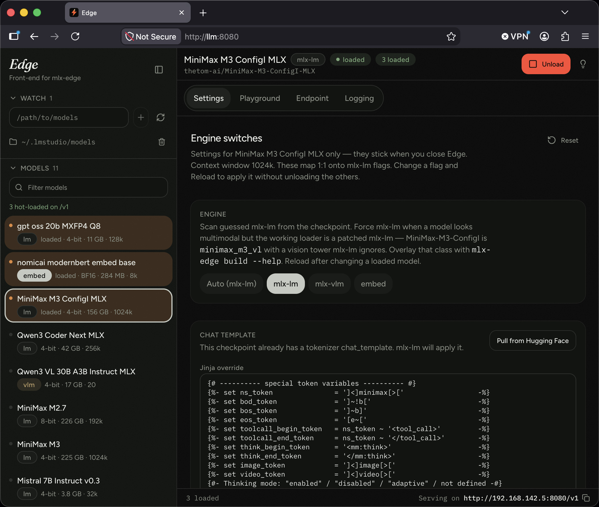

# Edge

<p align="center">
  
</p>

Local OpenAI-compatible gateway for Apple Silicon. Hot-load `mlx-lm`,
`mlx-vlm`, and embedding models side by side on one host/port. `edge-gui` is
the studio.

Compiled `mlx` comes from a wheel. The Python engines install from git HEAD so
new architectures land without waiting on a conda-forge rebuild.

## Install

Apple Silicon. [Miniforge](https://github.com/conda-forge/miniforge) is the
usual conda.

```bash
conda create -n edge python=3.13 uv pip git
conda activate edge
git clone https://github.com/milljm/bleeding-edge-mlx-server.git
cd bleeding-edge-mlx-server
uv pip install -r requirements.txt
edge-gui
```

`git` is in the conda create because `requirements.txt` pulls `mlx-lm`,
`mlx-vlm`, and `mlx-audio` from git HEAD. `uv pip` targets the active conda env
(`CONDA_PREFIX`).

That file also pins two extras mlx-vlm has not declared yet: `safetensors` and
`torchvision` (GLM-5 Next's vision tower imports torchvision — it pulls torch
Apple Silicon wheels, not a CUDA Stable Diffusion stack) and `mlx-audio`
(`mlx_vlm.server --tts-model` / `--stt-model`). Overlay a PR with
`mlx-edge build mlx-audio#N` the same way as mlx-vlm. TTS still needs an
**MLX** checkpoint (`mlx-community/Kokoro-*`, `mlx-community/chatterbox-fp16`)
— `hexgrad/Kokoro-82M` and `ResembleAI/chatterbox` on the Hub are PyTorch dumps
(no typed `config.json`) and will not list after a rescan.

`edge-gui` starts the gateway **and** the studio on the same host/port, then
opens a browser. The footer shows the OpenAI base URL:

```
Serving on http://127.0.0.1:8080/v1
```

Point any OpenAI-compatible chat client at that address. Watch folders and
per-model settings persist in `~/.config/mlx-edge/studio.json`. Watch has a
one-click **Hugging Face** (`~/.cache/huggingface/hub`) — mlx-lm / mlx-vlm
downloads land there — **LM Studio** (`~/.lmstudio/models`), and **Ollama**
(`~/.ollama/models`). The sidebar **Hugging Face** box takes a Hub URL; Edge lists MLX quants and downloads with
`huggingface_hub` (`HF_TOKEN` if you launched `edge-gui` with it set).

Remote clients (another machine on the LAN):

```bash
edge-gui --host 0.0.0.0 --port 8080
```

The footer then shows your LAN address, e.g. `http://192.168.1.50:8080/v1`.

Headless (no GUI):

```bash
mlx-edge serve --host 127.0.0.1 --port 8080
mlx-edge load --engine lm --model mlx-community/Qwen3-8B-4bit
mlx-edge load --engine vlm --model mlx-community/Qwen2.5-VL-7B-Instruct-4bit
mlx-edge load --engine embed --model mlx-community/Qwen3-Embedding-0.6B-4bit
mlx-edge load --engine tts --model mlx-community/Kokoro-82M-4bit
mlx-edge load --engine stt --model mlx-community/whisper-tiny-mlx
mlx-edge load --engine rerank --model mlx-community/Qwen3-Reranker-0.6B-4bit
mlx-edge load --engine image --model mlx-community/FLUX.1-schnell-4bit
```

Or preload at start:

```bash
edge-gui --host 127.0.0.1 --port 8080 \
  --lm mlx-community/Qwen3-8B-4bit \
  --vlm mlx-community/Qwen2.5-VL-7B-Instruct-4bit \
  --embed mlx-community/Qwen3-Embedding-0.6B-4bit \
  --tts mlx-community/Kokoro-82M-4bit \
  --stt mlx-community/whisper-tiny-mlx \
  --rerank mlx-community/Qwen3-Reranker-0.6B-4bit \
  --image mlx-community/FLUX.1-schnell-4bit
```

Unload one without touching the others:

```bash
mlx-edge unload --model mlx-community/Qwen3-8B-4bit
```

You will need to `conda activate edge` in every new shell.

## What you get

- **Studio.** Watch a folder, Serve / Reload / Unload, playground, logging, and
  per-model flags. Loaded (and loading) cards sort to the top. Serve fills the
  card left to right — orange in dark, green in light — until the engine is up.
  A live user chat or embed request pulses `generating`. Stop (header or the
  composer square) cancels it — including when a remote OpenAI client aborts
  the stream.
- **One `/v1`.** Chat, embeddings, and several models on the same URL.
  `GET /v1/models` lists each by basename and includes the checkpoint's context
  window (`context_length`) when `config.json` has it. Clients send that name
  as `model`.
- **Hot-load.** Each Serve is its own `mlx_lm.server` / `mlx_vlm.server` child.
  Switching `model` routes to a process that is already up — not an unload.
  [How that differs from LM Studio](docs/api.md#hot-load-vs-lm-studio).
- **Git HEAD engines.** Overlay `mlx-lm` / `mlx-vlm` from git. `mlx-edge build`
  overlays an unmerged PR when a new architecture lands days before merge.
- **Engine override.** Scan guesses `lm` / `vlm` / `embed`. Settings → Engine
  forces mlx-lm when a checkpoint looks multimodal but the working loader is a
  patched mlx-lm (MiniMax-M3 is `minimax_m3_vl` with a vision tower mlx-lm
  ignores). Sticks in `studio.json`. CLI: `mlx-edge load --engine lm`.

Dedicated embedding checkpoints (Qwen3-Embedding, bge, e5, gte, nomic, MiniLM)
scan as `embed` and spawn `mlx_vlm.server --embedding-model PATH`.

## Daily

```bash
conda activate edge
mlx-edge update          # refresh git HEAD of mlx-lm and mlx-vlm
mlx-edge build --help    # overlay a not-yet-merged PR (new model classes)
mlx-edge status          # local vs conda-forge vs PyPI vs git
edge-gui
```

`mlx-edge update` runs `pip install --upgrade --force-reinstall --no-deps git+…`
so pip cannot replace the compiled `mlx` wheel.

## Stack

| Layer | Package | Source of truth | Why |
| --- | --- | --- | --- |
| Runtime | `mlx` | PyPI wheel (or conda-forge) | Compiled Metal. Do not rebuild from git unless you mean to. |
| Text engine | `mlx-lm` | git overlay | Pure Python. Tracks new LLM architectures. |
| Vision engine | `mlx-vlm` | git overlay | Pure Python. Tracks VLMs / omni models. Also serves embeddings. |
| CLI | `mlx-edge` | this repo | `serve`, `load`, `unload`, `update`, `build`, `status`. |
| GUI | `edge-gui` | this repo | Studio that drives the CLI over `/v1`. |

## Safety

HEAD can be broken. Pin a SHA that works; roll back to PyPI/conda-forge if it is not.

```bash
mlx-edge pin                     # write ~/.config/mlx-edge/pins.json
mlx-edge update --pinned         # reinstall those SHAs
mlx-edge rollback                # conda-forge mlx-lm + mlx-vlm, mlx untouched
mlx-edge update lm --ref abc123  # one engine, one commit
```

`mlx-edge update mlx` is refused unless you pass `--force`.

New architectures often land in a GitHub PR days before they merge. Overlay that
exact ref without waiting:

```bash
mlx-edge build --help
mlx-edge build git+https://github.com/ml-explore/mlx-lm.git@refs/pull/1398/head
mlx-edge build 1398              # mlx-lm pull request
mlx-edge build mlx-vlm#42
```

`mlx-edge build --help` prints the mlx-lm and mlx-vlm pulls URLs. Serve failures
that look like a missing model class hint at the same command.

## CLI

```
edge-gui [--host 127.0.0.1] [--port 8080] [--lm MODEL]... [--vlm MODEL]... [--embed MODEL]... [--no-browser]
mlx-edge serve [--host 127.0.0.1] [--port 8080] [--gui] [--lm MODEL]... [--vlm MODEL]... [--embed MODEL]...
mlx-edge load --engine lm|vlm|embed --model MODEL [engine flags…]
mlx-edge unload --model MODEL
mlx-edge models
mlx-edge status [--json] [--offline]
mlx-edge update [lm|vlm|all] [--ref SHA] [--branch main] [--pinned] [--force] [--with-deps]
mlx-edge build [SPEC] [--engine lm|vlm|mlx] [--force] [--with-deps]
mlx-edge pin
mlx-edge rollback [lm|vlm|all]
mlx-edge doctor
mlx-edge which
mlx-edge engines
```

`--with-deps` lets pip resolve dependencies. That can replace the `mlx` wheel. Do not use it casually.

Old single-engine form still works and now hot-loads onto the gateway:

```bash
mlx-edge serve --engine lm --model mlx-community/Qwen3-8B-4bit
```

## Docs

- [HTTP API](docs/api.md) — `/v1` endpoints, progress, chat templates, thinking tags
- [Contributing](CONTRIBUTING.md) — GUI rebuild (`npm run build:gui`), tests, conda-forge recipe

`mlx-edge doctor` checks Darwin/arm64, `CONDA_DEFAULT_ENV`, git, Metal via
`mlx.core.metal`, and whether each engine imports.

Until the `conda-recipe/` sketch is accepted on conda-forge,
`uv pip install -r requirements.txt` inside the conda env as above.

## License

MIT. `mlx`, `mlx-lm`, and `mlx-vlm` keep their own licenses.
